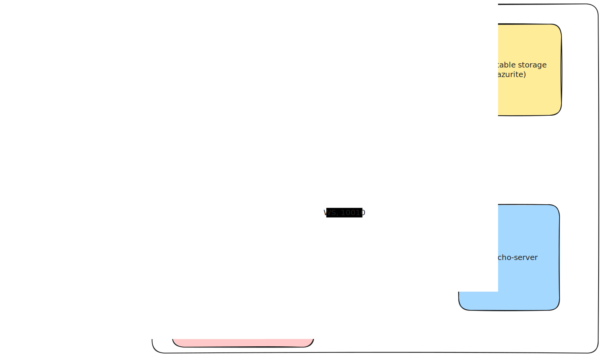

# orleans-ws-proxy

- [orleans dahsboard](http://localhost:5223/)
- [ws-proxy-client swagger](http://localhost:8082/swagger/index.html)

TODO Slides:
- distributed systems intro: stateless, stateful, data + behavior
- describe orleans approach, main ideas liek: grain, silo, location transparancy, cluster provider, placement, activation, single threaded execution
- examples: proxy, loadbalancing, ocppbridge
- architecture
- minikube demo
- show the code
