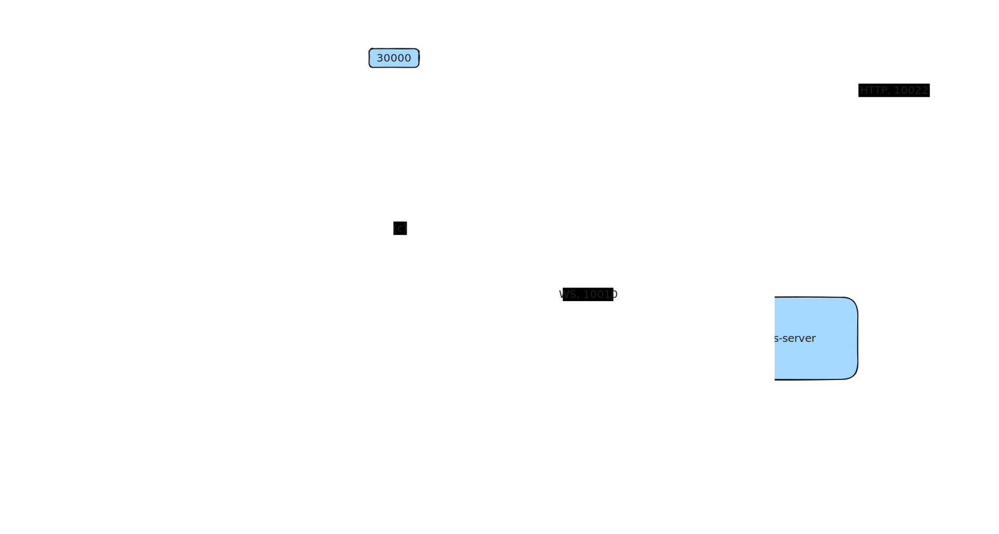

# orleans-ws-proxy

- [install minikube](https://minikube.sigs.k8s.io/docs/start/)
- deploy:
    - azurite
    - ws-echo-server
    - proxy
    - ws-proxy-client
- [orleans dahsboard](http://localhost:5223/) or `curl --resolve "orleans.portal:80:$( minikube ip )" -i http://orleans.portal`
- [ws-proxy-client swagger](http://localhost:8082/swagger/index.html)
- [presentation](./presentation/)

TODO Slides:
- distributed systems intro: stateless, stateful, data + behavior
- describe orleans approach:
    - actor model
    - grain
    - silo
    - location transparancy
    - placement, placement startegy (no need manual partitioning)
    - activation
    - single threaded execution, think about concurrency levels
    - streaming support
    - state (cheap caching)
    - cluster provider
- architecture
- show the code
- minikube demo
